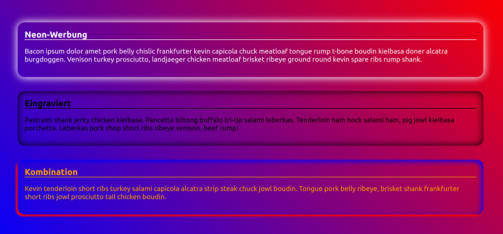

# Spaß mit Box-Shadows

Mithilfe der CSS-Eigenschaft box-shadow lassen sich ansprechende optische Effekte erzeugen. Mit ihnen können wir die Illusion von Tiefe herstellen.

Diese Übung deckt folgende Konzepte ab:
* Hintergrundbild und linearer Farbverlauf
* Außen- und Innenabstände
* Box-Shadows
* (ferner auch Rahmen und Rahmenradius)

## Anweisungen

Erstelle eine Seite mit drei Sektionen. Fülle jede mit einem geeingeten Überschrift-Element und einem Textabsatz.

Der Seitenhintergrund soll einen farbigen Verlauf als Hintergrundbild verwenden.
Die Sektionen selbst erhalten keine Hintergründe, die Effekte werden nur durch `box-shadow` geschaffen. Das letzte verwendet zwei Schatten am gleichen Element.

Spiel ein wenig mit Außen- und Innenabständen für body und die Sektionen selbst. Im Beispielbild haben die Überschriften einen unteren Rahmen. Die Sektionen sind etwas abgerundet.

Konzentriere dich auf das Verstehen der verwendeten Eigenschaften und Werte, das Bild muss nicht pixelperfekt nachgebaut werden.